# ControlPlane.ai

**A policy-driven Responsible AI checking layer for enterprises running multiple GenAI use cases at once.**

Built for the Accenture Innovation Challenge — Round 2 (Responsible AI Checker).

> Round 1 asked: how do you flag or block bias, hallucination, and privacy leaks in real time?
> Round 2 asks: how does that hold up when an enterprise runs a customer chatbot, an internal
> copilot, and a regulated decision-support tool *simultaneously*, each with a different risk
> appetite and latency budget, feeding on a mix of well- and loosely-governed data?
>
> ControlPlane.ai's answer: **don't build one checker — build one engine with per-use-case
> policy**, and make every decision it makes explainable and auditable.

---

## 1. What this prototype demonstrates

This is a working, runnable proof-of-concept of the core mechanism — not a mockup. It is intentionally
built to be inspected: every score, threshold, and decision is visible and traceable, because that is
the actual product (see [`BUSINESS_PROPOSAL.md`](BUSINESS_PROPOSAL.md) for the full business case).

| Requirement from the brief | Where it lives |
|---|---|
| Different risk tolerance / latency per use case | [`backend/config/policies.yaml`](backend/config/policies.yaml) — 3 distinct policy profiles |
| Bias, hallucination, privacy overlap | All 3 detectors run on every check; scores combine via **weighted** category scoring, not exclusive categories |
| No reliable real-time ground truth | Hallucination detector explicitly separates **"unverifiable"** (low retrieval confidence) from **"contradicted"** (claim conflicts with a retrieved source) |
| Over- vs under-flagging tuning | Per-policy thresholds (`allow_below` / `edit_below` / `block_at`) + a feedback loop that turns reviewer overrides into false-positive/negative proxies |
| Latency budgets vs. thoroughness | Tiered fast/deep detector passes; borderline fast-pass scores auto-escalate to a deep pass only when it's worth the cost |
| Governance / configurability | Policy registry (YAML) drives detector selection, weights, thresholds, and geo overrides — no code change needed to retune a use case |
| Audit trail | Every check is persisted (SQLite) with full score breakdown, decision, policy version, and latency |
| Feedback loop | `/api/feedback` lets a reviewer record the "correct" decision; the Metrics tab turns that into an override rate and FP/FN-like counts |
| API-layer only (no model internals) | All detection is pure input/output text analysis — works against any model behind any API |

## 2. Architecture

```mermaid
flowchart LR
    subgraph App Layer
        A[Customer Chatbot]
        B[Internal Copilot]
        C[Decision-Support Tool]
    end

    A & B & C -->|prompt + response| GW[ControlPlane Gateway<br/>POST /api/check]

    GW --> POL[Policy Engine<br/>use_case + geo -> weights, thresholds, detector depth]
    POL --> DET

    subgraph DET[Detector Fan-Out — runs in parallel]
        PII[PII / Entity Detector<br/>regex + structured patterns]
        HAL[Hallucination Detector<br/>retrieval verification + claim extraction]
        BIAS[Bias Detector<br/>overgeneralization + stereotype lexicon]
    end

    DET --> AGG[Weighted Score Aggregation]
    AGG --> DEC{Tiered Decision}
    DEC -->|allow| OUT1[Deliver as-is]
    DEC -->|edit| OUT2[Auto-redact, then deliver]
    DEC -->|flag_for_review| OUT3[Deliver + queue for human review]
    DEC -->|block| OUT4[Withhold response]

    DEC --> AUDIT[(Audit Trail — SQLite)]
    OUT3 & OUT4 --> HUMAN[Human Reviewer]
    HUMAN -->|correct decision| FB[/api/feedback/]
    FB --> AUDIT
    AUDIT --> METRICS[Metrics: override rate, FP/FN proxies, latency, volume]
```



**Where the checker sits:** as a synchronous **pre-response gate** — it sits between "model returns a
response" and "response reaches the user/agent." For real-time use cases this stays cheap (fast-pass
detectors, parallel execution, selective escalation). For batch/regulated use cases with a generous
latency budget, every detector always runs at full depth. This is a *pipeline pattern choice* baked
into policy, not a different codebase per use case.

## 3. Detection techniques used (and why)

- **PII detector** — regex/structured-pattern matching (email, phone, SSN, card numbers, IPs,
  ID-like strings, DOB). Fast, deterministic, always runs. Auto-redaction is applied when a check
  lands in the `edit` tier, so a borderline response can still ship with the leak removed instead of
  being blocked outright.
- **Hallucination detector** — retrieval verification against a small local knowledge base
  (`backend/knowledge_base/*.txt`, standing in for an internal RAG/document store). Fast pass = cheap
  topical-overlap check against the best-matching doc. Deep pass = sentence-level claim extraction
  (numbers, dates, percentages) verified against the *whole* corpus, which is the closest low-cost
  stand-in for a secondary "AI-as-judge" pass. Crucially, when nothing relevant is retrieved at all,
  the detector reports **"unverifiable"** at lower confidence rather than asserting the claim is false —
  this directly reflects the brief's point that there's often no reliable ground truth to check against.
- **Bias detector** — overgeneralization pattern matching ("all X are...") plus a stereotype-association
  lexicon scanned in a window around protected-attribute terms, with a deep-pass heuristic for
  asymmetric comparative framing across groups.
- **Overlap by design, not accident** — because all three detectors run on every check and contribute
  to one weighted score, a response that is simultaneously a fabricated detail about a person (PII +
  hallucination) scores on *both* axes instead of being force-fit into one category.

## 4. Governance: the policy registry

Three illustrative use-case profiles ship in [`policies.yaml`](backend/config/policies.yaml):

| Use case | Mode | Latency budget | Heaviest weight | Human review bar |
|---|---|---|---|---|
| `customer_support_chatbot` | real-time | 300ms | PII (0.45) — brand/regulatory cost of a leak is the top risk | 0.85 (only escalate when severe) |
| `internal_knowledge_copilot` | interactive | 1500ms | Hallucination (0.55) — bad "facts" propagate into employee decisions | 0.90 |
| `decision_support_regulated` | batch/gated | 5000ms | Hallucination (0.45), tightest thresholds overall | 0.40 (deliberately low — under-flagging is the real liability here) |

Geography overrides (`EU`, `US_HEALTHCARE`) multiply PII severity, showing how the same detector
output can mean a different risk score depending on jurisdiction, without touching detector code.
This is the extensibility point for "regulatory expectations differ and evolve" — new geographies or
sectors are config additions, not redeploys.

## 5. Tiered decisioning & the flagging tradeoff

Every check produces a 0–1 score per category, combined via the use case's weights into one overall
score, then mapped through **four tiers**: `allow → edit → flag_for_review → block`. This exists
specifically to avoid the brief's alert-fatigue trap: a one-size-fits-all block/allow gate either
over-blocks (users route around it) or under-blocks (real liability). The `edit` tier in particular
lets ControlPlane *fix* a response (redact the leak) instead of forcing a binary allow/deny call.

## 6. Feedback loop & metrics

`POST /api/feedback` lets a human reviewer record what the decision *should* have been. The Metrics
tab turns accumulated feedback into:

- **Override rate** — how often ControlPlane's decision didn't match the reviewer's call
- **False-positive-like count** — reviewer said "allow" where ControlPlane flagged/blocked (over-flagging signal)
- **False-negative-like count** — reviewer said "flag/block" where ControlPlane allowed (under-flagging signal, the more expensive failure mode)
- **Per-use-case latency and volume**, so a real deployment can watch whether a latency budget is actually being met

In a production build, sustained drift in these numbers is exactly the signal that should retune
`policies.yaml` thresholds — this prototype makes that loop visible even though it doesn't auto-tune yet
(see roadmap in the business proposal).

## 7. Running the prototype

```bash
pip install -r requirements.txt
python -m uvicorn main:app --reload --app-dir backend
```

Then open **http://127.0.0.1:8000** — the FastAPI app serves the dashboard directly, no separate
frontend build step.

**First run:** the app auto-seeds ~9 illustrative interactions (across all 3 use cases, with one
reviewer override) the first time it starts against an empty audit database, specifically so the
Business Dashboard / Detection Metrics / Audit Log aren't blank before you've run anything yourself
(see [`backend/seed_data.py`](backend/seed_data.py)). It only seeds once — delete
`backend/controlplane_audit.db` and restart if you want a truly clean slate.

- **Live Console** — pick a use case, load a built-in example (or write your own prompt/response
  pair), run a check, see the full score breakdown and explanation trace, and submit a reviewer
  override.
- **Business Dashboard** — the executive-facing view: KPI tiles (human review rate, auto-remediation
  rate, block rate, avg risk score, estimated incidents prevented, illustrative cost avoided, latency
  SLA compliance, reviewer override rate), a risk-by-use-case table, a use-case × category risk
  heatmap, a stacked decision-volume trend chart, a latency-vs-policy-budget chart, and a "what's
  driving risk" findings list. Backed by `GET /api/business-metrics`.
- **Detection Metrics** — the lower-level operational view: decision distribution, override rate,
  FP/FN-like counts, latency by use case. Backed by `GET /api/metrics`.
- **Audit Log** — every check ever run, with decision and latency.
- **Policy Registry** — the live policy JSON currently governing decisions.

The whole UI is responsive — grids collapse to fewer columns down to a single column on phone-width
screens, tables and the policy JSON scroll horizontally inside their own container instead of the
page, and the nav scrolls horizontally on narrow viewports instead of wrapping.

API docs (OpenAPI/Swagger) are auto-served at `/docs`.

## 8. Project structure

```
backend/
  main.py                 FastAPI app: orchestration, scoring, decisioning
  models.py                Pydantic request/response schemas
  policy.py                Policy registry loader + threshold decision logic
  audit.py                 SQLite persistence for checks + feedback + metrics
  config/policies.yaml     Governance layer — per-use-case policy
  knowledge_base/*.txt     Sample "source of truth" docs for hallucination checks
  detectors/
    pii.py
    hallucination.py
    bias.py
frontend/
  index.html               Dashboard (vanilla JS + Chart.js, no build step)
BUSINESS_PROPOSAL.md        Problem framing, solution design, business case, roadmap, risks
DEMO_SCRIPT.md              Walkthrough script for the demo video
```

## 9. Explicit assumptions (stated per the brief's invitation to adapt freely)

- Enterprise consumes foundation models via API only — no model-internals access, hence a pure
  input/output-layer checker.
- "Ground truth" is approximated here by a tiny local document set; in production this is the
  enterprise's actual RAG index / knowledge base / policy documents.
- Thresholds in `policies.yaml` are illustrative starting points, not a solved calibration — the
  business proposal treats threshold tuning via the feedback loop as an ongoing operational function,
  not a one-time setup step.
- No real PII, customer data, or proprietary model access is used anywhere in this repo.

## 10. What's deliberately out of scope for this prototype

- Multi-turn / agentic compounding-risk tracking (flagged as a Phase 2 item in the roadmap)
- Real embedding-model semantic search (uses TF-weighted cosine overlap to stay dependency-light and
  runnable anywhere with no GPU/API key)
- Auto-tuning thresholds from feedback (the loop is captured and visible; the tuning step is manual/human today)
